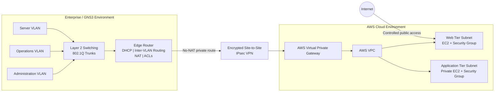
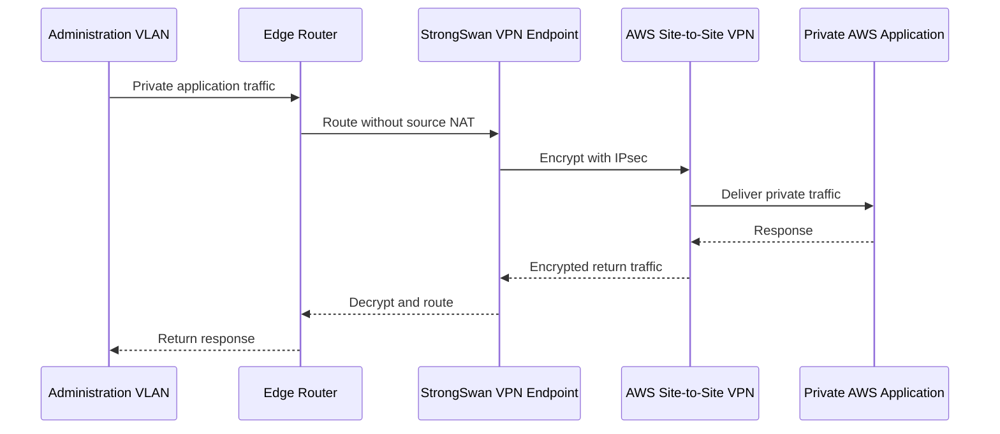

# Hybrid Cloud Network Engineering Capstone

A sanitized engineering case study of an officially passed B.S. Cloud and Network Engineering capstone that implemented and validated a secure hybrid network connecting a segmented enterprise environment in GNS3 to AWS through an encrypted Site-to-Site IPsec VPN.

> **Portfolio disclosure:** This repository is an employer-facing technical case study. It does not contain academic assessment instructions, evaluator materials, student information, credentials, restricted lab files, proprietary screenshots, or copied course configurations. Architecture diagrams and documentation in this repository are original portfolio artifacts created to explain the engineering work.

---

## Project Summary

The project required designing, implementing, troubleshooting, and validating a hybrid network that combined an on-premises-style enterprise environment with AWS cloud resources.

The local environment used multiple VLANs to separate administrative, operational, and server workloads. Routing, DHCP, NAT, and access-control policies were enforced through the edge router. The AWS side used a dedicated VPC with separate web and application network tiers, Security Groups, and private routing across an encrypted Site-to-Site VPN.

The final environment was tested through eight documented functional scenarios covering local segmentation, IP addressing, routing, source-based security policy, AWS segmentation, external access, hybrid VPN connectivity, encrypted data transfer, and security enforcement across the hybrid boundary.

---

## Architecture



The public diagram intentionally uses generalized labels and omits environment-specific addresses and implementation secrets.

For a deeper walkthrough, see [Architecture & Design Decisions](docs/architecture.md).

---

## Engineering Objectives

The implementation focused on the following goals:

- Segment enterprise users and servers into separate VLANs.
- Provide dynamic addressing where appropriate while preserving static addressing for infrastructure services.
- Route traffic between approved local segments.
- Enforce different access outcomes based on source network.
- Provide outbound Internet access without exposing internal addressing.
- Separate public-facing and private workloads in AWS.
- Establish encrypted private connectivity between the local environment and AWS.
- Preserve original source addresses across the VPN so security controls could make source-aware decisions.
- Validate both connectivity and denial conditions rather than testing only successful traffic flows.
- Preserve configuration state through version-controlled checkpoints.

---

## Local Network Design

The enterprise side was modeled in GNS3 and separated into three functional zones:

| Segment | Purpose | Design Intent |
|---|---|---|
| Administration VLAN | Authorized management/user traffic | Allowed access to approved internal and cloud resources |
| Operations VLAN | General operational users | More restrictive access to protected resources |
| Server VLAN | Local infrastructure/services | Static or predictable addressing and controlled reachability |

The edge router provided:

- DHCP services for user networks
- Inter-VLAN routing
- Outbound NAT
- Static/private routing toward AWS
- ACL-based source filtering
- A no-NAT path for VPN-bound traffic

Layer 2 switching used VLAN membership and 802.1Q trunks to preserve segmentation between switches.

---

## AWS Network Design

The AWS environment used a dedicated VPC with separate workload tiers:

### Web Tier

- Placed in a distinct subnet
- Hosted an EC2 web workload
- Allowed controlled external reachability
- Protected by a purpose-built Security Group

### Application Tier

- Placed in a separate private-oriented subnet
- Hosted an EC2 application workload
- Not intended for direct public exposure
- Restricted with source-aware Security Group rules

This separation allowed public access to terminate at the web layer while keeping application resources governed by private routing and security policy.

---

## Hybrid Connectivity

The hybrid path combined AWS Site-to-Site VPN components with a StrongSwan IPsec endpoint on the customer side.



A key implementation decision was preserving the original private source network across the VPN. This allowed cloud-side security controls to distinguish authorized Administration traffic from restricted Operations traffic instead of treating all VPN traffic as one trusted source.

---

## Security Model

The design used layered controls rather than relying on the VPN alone:

- **VLAN segmentation** separated local trust zones.
- **ACLs** enforced source-based policy at the local router.
- **No-NAT VPN routing** preserved source identity across the hybrid path.
- **AWS Security Groups** limited access to cloud workloads.
- **Public/private subnet separation** reduced unnecessary exposure.
- **IPsec encryption** protected traffic crossing the hybrid boundary.
- **Validation of denied traffic** confirmed that connectivity did not equal unrestricted trust.

The strongest security validation used the same private AWS application destination with two different local source networks. The authorized source succeeded while the restricted source was blocked, demonstrating policy enforcement across the hybrid boundary.

See [Security Controls](docs/security-controls.md) for additional detail.

---

## Functional Validation

The final implementation was validated through eight structured test scenarios.

| Test Area | What Was Validated | Result |
|---|---|---|
| Layer 2 segmentation | VLAN membership, trunking, same-segment communication | PASS |
| Addressing | Dynamic user addressing and static infrastructure addressing | PASS |
| Local routing | Inter-VLAN routing and expected path behavior | PASS |
| Local security policy | Authorized source allowed; restricted source denied | PASS |
| AWS networking | VPC/subnet segmentation, workload access, routing | PASS |
| External access | Controlled reachability of the public web tier | PASS |
| Hybrid VPN | Established IPsec tunnel and private AWS reachability | PASS |
| Hybrid security | Source-aware policy enforced across the VPN | PASS |

The VPN validation went beyond checking whether configuration objects existed. The implementation verified:

- an established and installed IPsec security association,
- AWS reporting the active VPN tunnel as operational,
- successful reachability to private AWS workloads,
- encrypted packet and byte counters increasing during data-plane tests, and
- preserved configuration state in version control.

See [Validation Strategy](docs/validation.md) for the public testing methodology.

---

## Troubleshooting & Recovery Mindset

The project required more than initial configuration. The engineering process emphasized recovery and evidence:

1. Validate the intended state before changing configuration.
2. Isolate Layer 2, Layer 3, NAT, ACL, VPN, and cloud security behavior independently.
3. Confirm both control-plane state and data-plane traffic.
4. Verify successful traffic and intentional denial conditions.
5. Re-test after remediation instead of assuming configuration changes succeeded.
6. Preserve known-good milestones in version control.

This approach helped separate routing problems from security-policy problems and VPN negotiation from actual encrypted application traffic.

---

## Technologies & Skills Demonstrated

**AWS**  
VPC • EC2 • Security Groups • Site-to-Site VPN • Virtual Private Gateway • Customer Gateway Concepts • Public/Private Network Design

**Networking**  
VLANs • 802.1Q • DHCP • NAT • ACLs • Inter-VLAN Routing • Static Routing • IPsec • Source-Based Policy • Network Segmentation

**Lab & Operations**  
GNS3 • StrongSwan • Linux Networking • Connectivity Testing • Failure Isolation • Recovery Validation

**Engineering Workflow**  
Git • GitLab • Configuration Checkpoints • Evidence-Based Testing • Technical Documentation • Architecture Design

---

## Key Engineering Lessons

### A VPN Is Connectivity, Not Trust

Establishing an encrypted tunnel should not automatically grant every connected network access to every cloud workload. Source-aware controls were preserved and tested across the hybrid boundary.

### Control Plane and Data Plane Must Both Be Verified

A tunnel reporting `UP` does not prove application traffic is actually crossing it. Validation included private workload reachability and nonzero encrypted traffic counters.

### Denied Traffic Is Evidence Too

A security design is not validated only by successful pings. Intentional failure from a restricted source demonstrated that segmentation and access-control rules were doing useful work.

### Address Translation Can Break Security Intent

Preserving original private source addressing across the VPN was necessary for downstream policy decisions. A blanket NAT design would have obscured source identity.

### Version Control Supports Recovery

Configuration checkpoints provided a repeatable recovery path after topology and security changes and made the implementation easier to reproduce and audit.

---

## Repository Structure

```text
hybrid-cloud-network-engineering-capstone/
├── README.md
└── docs/
    ├── architecture.md
    ├── security-controls.md
    ├── validation.md
    └── lessons-learned.md
```

---

## Academic & Publication Note

This project originated as a university capstone and was officially evaluated as passing. This public repository intentionally documents only the engineering concepts, architecture, sanitized implementation decisions, validation strategy, and lessons learned that are appropriate for a professional portfolio.

It does **not** publish:

- assessment instructions or rubrics,
- evaluator feedback,
- student identifiers,
- lab credentials or secrets,
- institution-provided configuration files,
- restricted source materials,
- original submission screenshots, or
- any content that would allow the academic assessment to be reconstructed as a solution package.

---

## Next Steps

Potential independent extensions to this architecture include:

- Rebuild the cloud infrastructure with Terraform modules.
- Add automated configuration validation through CI/CD.
- Add centralized CloudWatch and VPC Flow Log monitoring.
- Add redundant VPN tunnels and explicit failover testing.
- Replace static routing with a dynamic routing design where appropriate.
- Add Infrastructure as Code security scanning.
- Add automated network reachability and policy tests.
- Extend the architecture with containerized workloads or EKS.

---

## Status

**Capstone: Officially Passed**  
**Degree: Conferral Pending**
