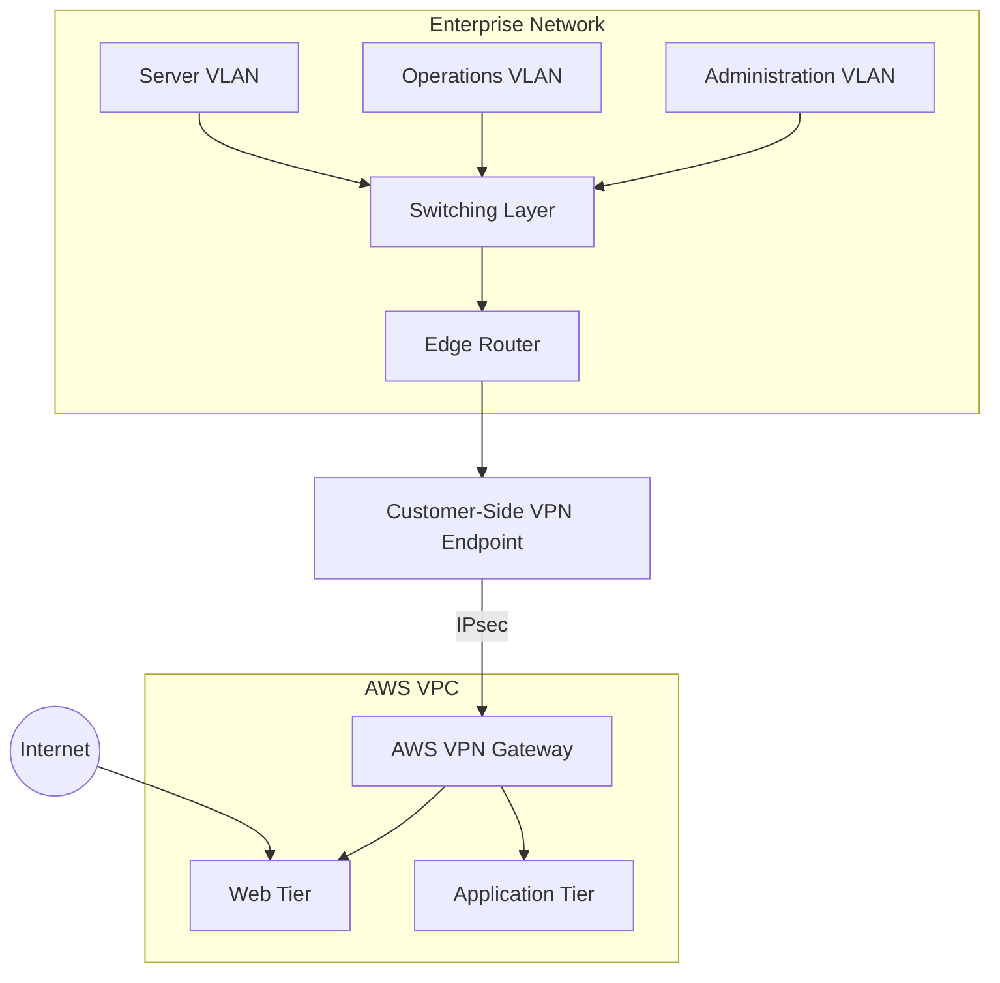

# Architecture & Design Decisions

## Overview

The capstone implemented a hybrid architecture connecting a segmented enterprise network modeled in GNS3 to AWS over encrypted Site-to-Site IPsec connectivity.

This document intentionally uses generalized labels and omits environment-specific credentials, public endpoints, restricted screenshots, and institution-provided configuration details.

---

## Logical Architecture



---

## Enterprise Segmentation

Three local trust zones were used:

- **Administration** — authorized users requiring broader access to approved resources.
- **Operations** — operational users with a deliberately narrower policy.
- **Servers** — infrastructure and service workloads requiring predictable addressing and controlled reachability.

VLANs provided Layer 2 separation, while 802.1Q trunks carried the required VLANs between switching elements.

The edge router provided the Layer 3 boundary and implemented:

- DHCP for user networks,
- inter-VLAN routing,
- outbound NAT,
- static/private routes,
- source-based ACL policy, and
- a no-NAT path for private VPN traffic.

---

## AWS Segmentation

The cloud side used a dedicated VPC with separate web and application tiers.

### Web Tier

The web workload was designed for controlled external reachability and placed behind a Security Group tailored to its role.

### Application Tier

The application workload used private addressing and was intentionally not treated as a public service. Its Security Group allowed only approved sources and protocols.

Separating these tiers reduced unnecessary exposure and made it possible to validate both public and private access paths independently.

---

## Hybrid Routing

The hybrid path used AWS Site-to-Site VPN components and StrongSwan on the customer side.

A key routing decision was to preserve original private source addresses across the VPN rather than translating them before encryption. This enabled downstream security controls to distinguish traffic by its originating local segment.

Conceptually:

```text
Local VLAN
   |
   v
Edge Router
   |
   | private route / no source NAT
   v
StrongSwan
   |
   | encrypted IPsec tunnel
   v
AWS VPN Gateway
   |
   v
AWS Private Workload
```

---

## Design Tradeoffs

### Static Routing vs Dynamic Routing

The implemented environment used a controlled static-routing approach suitable for the project scope. A larger production environment would benefit from dynamic routing and redundant VPN paths to improve failover and route convergence.

### Single Active Tunnel for Validation

The functional validation concentrated on one established AWS VPN tunnel. Production designs should use redundant tunnels and test failover behavior explicitly.

### Lab-Scale Simplicity vs Production Hardening

The implementation was intentionally scoped for reproducible validation. A production build would add centralized logging, automated configuration management, infrastructure as code, continuous compliance checks, and additional availability controls.

---

## Why the Architecture Matters

The project demonstrates more than basic cloud connectivity. The important engineering outcome was preserving segmentation and policy across two different environments.

The local network and AWS environment did not become one flat trusted network simply because a VPN existed. Routing, source identity, Security Groups, ACLs, and workload placement were all used together to create controlled hybrid reachability.
