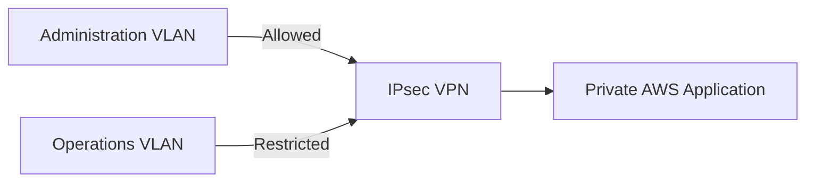

# Security Controls

## Security Objective

The hybrid network was designed so that connectivity did not automatically imply trust. Local segmentation, routing policy, cloud-side Security Groups, and IPsec encryption worked together to produce different outcomes for different source networks.

---

## Layered Controls

### VLAN Segmentation

Separate VLANs divided Administration, Operations, and Server workloads into distinct trust zones. This reduced unnecessary Layer 2 exposure and created clean policy boundaries for routing and access control.

### Router ACLs

Source-based ACLs enforced different access rules for different local networks. The design specifically validated that an authorized source could reach a protected destination while a restricted source could not.

### No-NAT VPN Path

VPN-bound traffic preserved its original private source addressing. This was critical because cloud-side controls needed to distinguish Administration-originated traffic from Operations-originated traffic.

### AWS Security Groups

Security Groups limited access to AWS workloads according to their role and source. The public-facing web tier had a different exposure model from the private application tier.

### Public/Private Workload Separation

The web and application workloads were placed in separate network tiers so that Internet-facing access did not require direct exposure of the private application workload.

### IPsec Encryption

The hybrid connection used Site-to-Site IPsec so traffic between the local environment and AWS crossed the hybrid boundary through an encrypted tunnel.

---

## Source-Aware Hybrid Policy

The strongest validation used the same private AWS application destination with two different local source networks:

- Administration traffic was authorized.
- Operations traffic was intentionally restricted.

This demonstrated that the hybrid architecture preserved source identity and security intent across the VPN rather than flattening all connected networks into one trust zone.

---

## Security Principles Demonstrated

- Least privilege
- Network segmentation
- Source-aware access control
- Defense in depth
- Private routing
- Encryption in transit
- Validation of expected denial behavior
- Separation of public and private workload exposure

---

## Production Improvements

A production version could extend these controls with:

- AWS Network Firewall or additional inspection layers
- Centralized CloudWatch and VPC Flow Log analysis
- AWS Config compliance rules
- GuardDuty threat detection
- IAM least-privilege automation
- Secrets Manager or Parameter Store for sensitive values
- Terraform-based policy enforcement
- CI/CD security scanning
- Automated reachability and regression testing
- Redundant VPN tunnel failover testing
